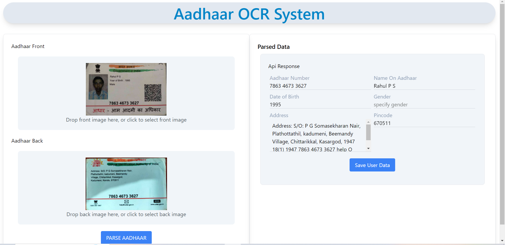
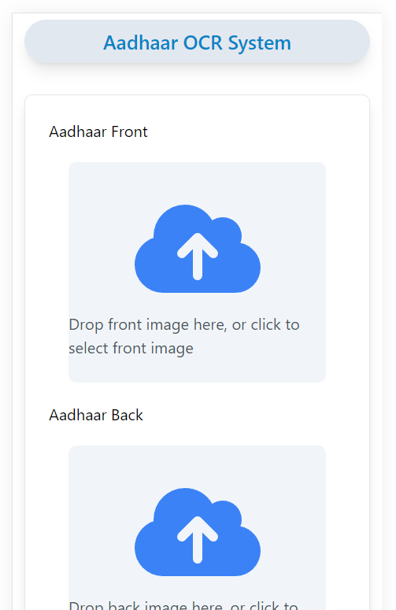

# Aadhar OCR System

Built a MERN stack web application to perform OCR (Optical Character Recognition) on
Aadhaar cards. The application will allow users to upload images of the front and back of an
Aadhaar card, process these images through an API, and display the extracted information
on the frontend.

## Features

- created front end app
- tailwind css added
- added react drop zone
- added image preview
- show errors
- created api to send data to backend
- created server using express
- created route and controllers
- install "ocr-space-api-wrapper
- created api id for ocr space from https://ocr.space/
- configured ocr space and pass images to data from both front and back images
- extracted necessary details from extracted data
- sed data back to frontend
- display the api response in frond end
- made front end responsive

## API Reference

#### upload images for ocr detection

```http
  POST

  /api/upload
```

        {
          method: "POST",
          body: formDataToSend,
        }

## Deployment

To deploy this project run

```bash
  npm run deploy

```

## Run server

Go to the project directory

```bash
  cd server
```

Install dependencies

```bash
  npm install
```

Start the server

```bash
  npm run start
  or
  nodemon

```

## Run Frontend

Go to the project directory

```bash
  cd client
```

Install dependencies

```bash
  npm install
```

Start the client

```bash
  npm run start

```

## Tech Stack

**Client:** React, TailwindCSS

**Server:** Node version v16.20.0, Express,

## 🔗 Links

https://github.com/RahulPSkadumeni/Optical-character-recognition-App-

## live Links

https://unrivaled-capybara-70ee56.netlify.app/

## Screenshots



mobile view


